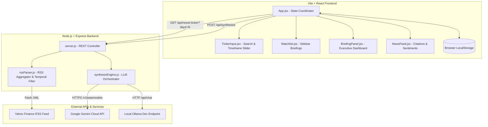
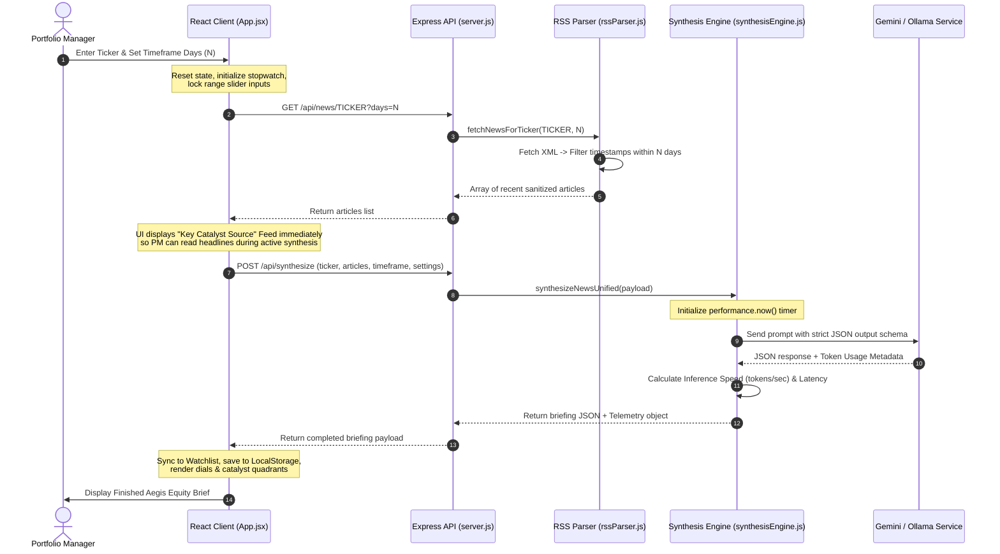

# Aegis Equity Brief — Software Architecture & Developer Guide

This document provides a comprehensive technical overview of the Aegis Equity Brief platform's architecture, data flows, LLM integrations, state management, and design system. It is designed for developers, software architects, and technical maintainers.

---

## 1. System Overview

Aegis Equity Brief is structured as a decoupled client-server application optimized for real-time feed aggregation and local/cloud large language model (LLM) inference.



*   **Vite + React Frontend**: Renders a premium, glassmorphic obsidian dashboard. It manages active stock viewports, historical caching, progressive loading checkpoints, and handles custom input telemetry in real time.
*   **Express.js Backend**: Serves as a secure API gateway. It acts as an XML RSS feed parser to aggregate public news without CORS blocks, filters articles dynamically based on requested days limits, packages LLM prompt frameworks, parses structured JSON syntaxes, and profiles model inference performance.
*   **Decoupled LLM Layer**: Standardized unified synthesis interface that routes prompts dynamically to either **Google Gemini (Cloud)** or a **local Ollama (Gemma, Llama)** container depending on user settings.

---

## 2. End-to-End Ticker Analysis Lifecycle

When a Portfolio Manager inputs a ticker symbol (e.g. `AAPL`) and triggers an analysis, the system processes the request through the following six distinct steps, managed by a progressive status tracker:



---

## 3. Data Schema & Contracts

### 3.1. Watchlist Item (Equity Briefing Payload)
Briefing items are saved to the browser's `localStorage` (under the key `aegis_watchlist`) and represent the fully compiled analysis brief.

```typescript
interface EquityBriefing {
  ticker: string;                  // e.g. "AAPL"
  name: string;                    // Company name resolved by LLM, e.g. "Apple Inc."
  sentiment: number;               // Consolidated score: 0 to 100
  sentimentLabel: string;          // e.g., "Bullish", "Strong Bearish"
  executiveSummary: string;        // High-level PM synthesis brief
  portfolioActions: string[];      // Array of concrete tactical actions
  catalysts: {
    financials: string[];          // Earnings & Balance Sheet triggers
    macro: string[];               // Interest rates, FX, sector flows
    productTech: string[];         // Tech rollouts, Silicon cycles
    regulation: string[];          // Antitrust, legal filings
  };
  risks: string[];                 // Downside risk profile factors
  newsItemSentiments: Array<{
    title: string;                 // Sanitized article headline
    sentiment: "Bullish" | "Bearish" | "Neutral";
    impactSummary: string;         // Brief qualitative impact explanation
    usedInSynthesis: boolean;      // Marks key catalyst sources contributing to the brief
  }>;
  requestedTimeframeDays: number;  // The news aggregation scope requested (1 to 20 days)
  timestamp: string;               // ISO 8601 generation date
  performance?: TelemetryMetrics;  // Optional LLM performance tracker data
}
```

### 3.2. LLM Performance Telemetry (`TelemetryMetrics`)
Calculated dynamically by the server and returned alongside the synthesis briefing.

```typescript
interface TelemetryMetrics {
  provider: "gemini" | "ollama";   // Model processor
  model: string;                   // Specific model identifier (e.g. "gemini-1.5-flash")
  promptTokens: number;            // Tokens parsed in context window
  completionTokens: number;        // Tokens generated in response
  totalTokens: number;             // Total footprint
  generationTimeSec: number;       // Latency in seconds (pure inference time)
  tokensPerSecond: number;         // Throughput (completionTokens / generationTimeSec)
}
```

---

## 4. Backend Architecture

The backend is built as a lightweight node gateway (`backend/server.js`) mapping routing targets cleanly.

### 4.1. Temporal RSS Filter (`backend/utils/rssParser.js`)
Pulls Yahoo Finance's XML RSS channels, parses elements using `rss-parser`, strips HTML descriptions, and filters them strictly on dynamic timestamp limits:
```javascript
const timeLimitMs = (daysLimit || 2) * 24 * 60 * 60 * 1000;
const filterTimeAgo = Date.now() - timeLimitMs;

const recentItems = feed.items.filter(item => {
  const dateStr = item.pubDate || item.isoDate;
  if (!dateStr) return false;
  const timestamp = Date.parse(dateStr);
  return !isNaN(timestamp) && timestamp >= filterTimeAgo;
});
```

### 4.2. Unified Synthesis Engine (`backend/utils/synthesisEngine.js`)
Aggregates news lists and formats instructions for the LLM. 

*   **Google Gemini Integration**: Calls the `@google/genai` API SDK using the `gemini-1.5-flash` model. Prompts enforce structured schemas utilizing `responseMimeType: "application/json"`. Telemetry extracts token count values directly from the API response metadata:
    ```javascript
    const usage = response.usageMetadata;
    const promptTokens = usage?.promptTokenCount || 0;
    const completionTokens = usage?.candidatesTokenCount || 0;
    ```
*   **Local Ollama Integration**: Connects to the local service endpoint (default: `http://localhost:11434/api/chat`). Sends JSON payloads and computes precise local hardware metrics directly from non-stream response parameters:
    ```javascript
    const promptTokens = body.prompt_eval_count || 0;
    const completionTokens = body.eval_count || 0;
    // convert nanoseconds to seconds
    const generationTimeSec = (body.eval_duration || 0) / 1e9;
    ```

---

## 5. Frontend Architecture & Design System

The frontend is structured to coordinates global workflows in `App.jsx` and delegates rendering to isolated stateless components.

### 5.1. Global State Management
Global configuration is structured reactively using hooks:
*   `timeframeDays`: Range slider indicator synchronized E2E during fetches.
*   `watchlist`: Cache array mapping the sidebar histories.
*   `settings`: Secure provider details synced cleanly to `localStorage` under keys `aegis_connection_settings` and `gemini_api_key`.
*   `activeSynthesis` & `activeArticles`: Main panels display coordinators.
*   `analysisStep`: Progressive checker stopwatch state.

### 5.2. Watchlist Self-Healing Mechanism
To prevent crashes when loading older briefings generated without modern properties, `App.jsx` executes a self-healing block on mounting:
```javascript
const parsed = JSON.parse(saved);
return parsed.map(item => {
  const updatedItem = {
    requestedTimeframeDays: 2, // Fallback default for legacy items
    ...item
  };
  // Reinject mock properties if referring to standard baseline stocks
  if (item && item.ticker && MOCK_SYNTHESES[item.ticker]) {
    return {
      ...updatedItem,
      ...MOCK_SYNTHESES[item.ticker],
      timestamp: item.timestamp || new Date().toISOString()
    };
  }
  return updatedItem;
});
```

### 5.3. Design System & CSS Architecture (`frontend/src/index.css`)
Styled using standard CSS tokens. Notable specifications:
*   **Obsidian theme background gradient**:
    ```css
    body {
      background-color: #07080c;
      background-image: 
        radial-gradient(at 0% 0%, rgba(0, 212, 255, 0.03) 0px, transparent 50%),
        radial-gradient(at 100% 100%, rgba(0, 255, 136, 0.02) 0px, transparent 50%);
    }
    ```
*   **Custom Range Slider Styling**: Disables default browser styles via `-webkit-appearance: none;` and adds a glassmorphic background with custom range thumb glows:
    ```css
    .timeframe-slider::-webkit-slider-thumb {
      -webkit-appearance: none;
      width: 14px;
      height: 14px;
      border-radius: 50%;
      background: var(--color-accent); /* #00d4ff */
      box-shadow: 0 0 10px rgba(0, 212, 255, 0.8), 0 0 4px rgba(0, 212, 255, 0.4);
      cursor: pointer;
      transition: transform 0.15s ease, box-shadow 0.15s ease;
    }
    .timeframe-slider::-webkit-slider-thumb:hover {
      transform: scale(1.25);
    }
    ```

---

## 6. Performance & Scaling Considerations

1.  **Context Optimization**: Large RSS news streams contain heavy duplicate text. Strip html tags and select only high-level title + short snippets before building the prompt. This keeps context footprints small, maintaining fast inference latency and low token costs.
2.  **Stateless API Design**: The Express proxy remains stateless. It delegates user identity and API credentials directly to the client browser request context, preventing database breaches or data leakage.
3.  **Local vs Cloud Orchestration**: Offering local Ollama integration enables local network sandbox execution. Users can analyze highly confidential stock indexes or private feeds without transmitting trade signals or target vectors outside their internal corporate networks.
