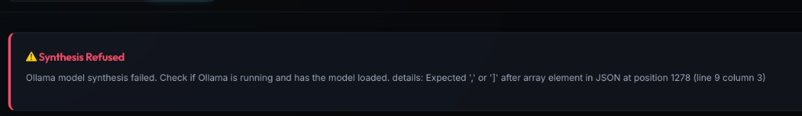

# 🛡️ Aegis Equity Brief — PM News Synthesizer

Aegis Equity Brief is a premium, high-fidelity web intelligence application built specifically for Portfolio Managers (PMs), financial analysts, and asset managers. The application aggregates raw, real-time public news streams, filters temporal scopes, and leverages advanced large language models (LLMs) to synthesize tactical consensus briefs.

The platform is designed around a stunning **Obsidian Glassmorphism** aesthetic, utilizing custom animations, high-fidelity SVGs, real-time stopwatch step checklists, and extensive telemetry reporting.



---

## 🌟 Key Product Features

### 1. Unified LLM Integration (Cloud & Local Sandbox)
Securely routes synthesis workloads dynamically:
*   **Google Gemini (Cloud)**: Integrates with the Google Gemini Cloud API for ultra-low latency, high-accuracy structural briefings.
*   **Ollama (Local Sandbox)**: Run offline or sandbox queries locally using your own models (e.g. `gemma`, `llama3`). Enables analysis of high-compliance indexes or proprietary tickers without leaking sensitive signal vectors to public networks.

### 2. E2E Customizable News Timeframe Selector
Adjust your news history aggregating scope from **1 to 20 days** using a sleek horizontal glass range slider.
*   Dynamically filters Yahoo Finance's RSS feed on the backend.
*   Automatically updates loading checkpoints and final executive brief citation subtitles.
*   Choice is saved locally in browser persistence and loaded dynamically on selecting historical entries.
*   *Self-Healing Cache Migration*: Automatically upgrades legacy stock cache files to the new data model without data loss or UI whiting-out.

### 3. LLM Inference Telemetry Dashboard
Visualizes direct metrics of model throughput and capacity:
*   **Speed Tracking**: Real-time throughput measures in **Tokens per Second (tok/s)**.
*   **Capacity Mapping**: Direct display of prompt token footprints and completion token counts.
*   **Latency Stopwatch**: Microsecond precision generation timers resolving live in the loading board and permanently preserved below the briefing summary.


### 4. Highlight Catalyst Sources (Audit Citation System)
Accelerates review times by immediately showing source audit markers. 
*   Analyzes each headline during synthesis and appends a `"usedInSynthesis": true` boolean.
*   Renders a glowing electric-cyan `✓ Key Catalyst Source` tag in the public news feed accordion so you see exactly which headlines directly shaped the synthesized summary, actions, or risks.

### 5. Watchlist & Workspace Sidebar Management
*   **Briefing Caching**: Seamlessly syncs generated briefs to your active watchlist history.
*   **Pruning Controls**: Delete individual historic briefs using smooth fade-out buttons or purge the entire local cache with the "Clear All" database command.
*   **Cascading Fallback**: Removing active viewports automatically shifts focus to the next available stock, preventing empty states.

---

## 📂 Monorepo Directory Layout

```text
├── backend/                  # REST Proxy Server & AI Engine
│   ├── utils/
│   │   ├── rssParser.js      # Temporal XML parser and RSS aggregator
│   │   └── synthesisEngine.js # Unified Ollama & Gemini API integrator
│   ├── server.js             # API entry controller and routing proxy
│   ├── package.json
│   └── .env.example
├── frontend/                 # React client dashboard (Vite built)
│   ├── src/
│   │   ├── components/       # Watchlist, ApiKeyModal, BriefingPanel, etc.
│   │   ├── utils/
│   │   │   └── mockData.js   # Pre-synthesized전문 stock data baselines
│   │   ├── App.jsx           # Main layout, progressive loaded checklists
│   │   ├── index.css         # Customizable glassmorphism visual CSS tokens
│   │   └── main.jsx
│   ├── index.html            # Setup web viewport, custom Google Fonts
│   └── package.json
├── ARCHITECTURE.md           # Deep-dive system design & sequence graphs
├── package.json              # Monorepo task workspace manager
└── README.md
```

---

## 🚀 Installation & Setup

### Prerequisites
*   **Node.js**: Version 18 or higher is required.
*   **Ollama (Optional)**: If you intend to run local inferences inside a network sandbox.

### 1. Clone & Install Dependencies
From the repository root directory, run the monorepo setup script. This installs packages for the root, frontend, and backend packages concurrently:
```bash
npm run install:all
```

### 2. Configure Credentials & Connections

To perform live, real-time synthesis on arbitrary stock tickers (e.g., `AMD`, `GOOGL`), you need to connect to an active model.

#### Option A: Cloud Gemini (Client-Side)
Launch the application, click **⚙️ Connection Settings** in the bottom-left sidebar, select **Google Gemini**, and enter your API Key. Your key is saved securely inside your browser's private local storage and never touches our backend logs.

#### Option B: Cloud Gemini (Server-Side)
Create a `.env` file inside the `backend/` directory from the template `.env.example`:
```env
GEMINI_API_KEY=AIzaSyYourKeyHere...
```

#### Option C: Local Sandbox (Ollama)
Start your local Ollama app instance in your terminal:
```bash
ollama run gemma
```
Launch the Aegis settings panel, select **Ollama (Local)**, adjust the server port if different (default: `http://localhost:11434`), and select your model (e.g. `gemma`).

*Note: If no connection is configured, the application executes in **Demo Mode**. You can click major stock tags (`AAPL`, `NVDA`, `TSLA`, `MSFT`) to instantly showcase the complete visual panel and telemetry dials with realistic mock data.*

### 3. Launching the App
Run the dev task to boot both servers concurrently:
```bash
npm run dev
```

*   **Frontend Dashboard**: [http://localhost:5173](http://localhost:5173) (hot-reloading enabled)
*   **Backend Node Service**: [http://localhost:5001](http://localhost:5001) (nodemon hot-reloading)

---

## 💡 User Guidance & Workflow

### 1. Analyzing a Stock
1.  Type a stock ticker symbol (e.g. `AAPL`, `MSFT`, `AMD`) in the top lookup bar.
2.  Slide the **News Timeframe** range selector. Slide left to focus strictly on breaking market news (e.g. `1 Day` or `2 Days`), or slide right to pull historical context up to `20 Days`.
3.  Click **Analyze** (or hit Enter).
4.  Track progress through the **Progressive Checklist**: Scrape Headlines ➔ Enforce Temporal Filters ➔ Structured Payloads ➔ Execute Inference ➔ Self-Healing JSON Audits ➔ Compiling Dashboard.
5.  *Pro-Tip*: The scraped news headlines are loaded below *instantly* during the synthesis step so you can begin reading the feed while the model runs in the background.

### 2. Auditing LLM Outputs
*   **Citations**: Expand the **Analyzed Source Feeds** panel. Headlines marked with the electric-blue **✓ Key Catalyst Source** badge represent the exact articles that directly informed the synthesized summary.
*   **Performance Metrics**: Read the **LLM Inference Telemetry** bar below the executive summary to evaluate model speeds, latency, and token contexts.
*   **Catalysts & Recommendations**: Toggle between the dashboard tabs:
    *   *Tactical PM Actions*: Active strategic moves suggested for risk control.
    *   *Market Catalysts*: Multi-quadrant breakdown separating Financials, Macro forces, Product Innovation, and Regulation.
    *   *Downside Risks*: Lingering headwinds or systemic dangers.

### 3. Portfolio Reporting
*   Click **📋 Copy Brief** to copy a beautifully structured plaintext brief directly to your clipboard for instant sharing in Slack, Microsoft Teams, or emails.
*   Click **🖨️ Export PDF** (or press `Cmd+P` / `Ctrl+P`) to trigger the print utility. The custom print stylesheet hides sliders, dials, and scrollbars, outputting a perfectly formatted, monochrome executive brief suitable for physical portfolios or investor decks.
